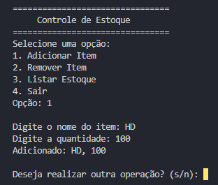
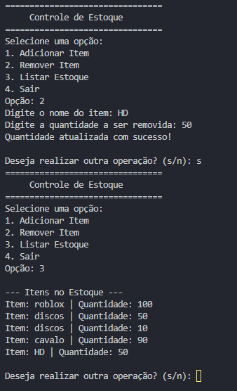

# 📌 Calculadora Baseada em Texto em C

## 📖 Descrição
Este projeto é um sistema de estoque que gere um arquivo .txt com a quantidade de itens no estoque. Com as funções de adicionar, remover e listar os itens.

## 🎥 Demonstração




## 📦 Pré-requisitos

- Compilador C instalado (exemplo: GCC)
- Sistema operacional compatível com C (Windows, Linux, macOS)

## 🚀 Instalação e Execução

1. Clone este repositório:
   ```sh
   git clone https://github.com/gabrieldotmasterson/estoque-c.git
   ```
2. Acesse o diretório do projeto:
   ```sh
   cd estoque-c
   ```
3. Compile o código-fonte:
   ```sh
   gcc main.c -o estoque
   ```
4. Execute o programa:
   ```sh
   ./estoque
   ```

## 🛠 Uso

1. Execute o programa.
2. Escolha uma operação digitando o número correspondente.
3. Insira os números solicitados.
4. Veja o resultado.
5. Escolha se deseja continuar ou sair.

## 📂 Estrutura do Projeto

```
calculadora-c/
│── main.c
│── README.md
│── LICENSE
│── imgs
   │── Captura.PNG

```

- `main.c`: Código-fonte principal da calculadora.
- `README.md`: Documentação do projeto.
- `LICENSE`: Arquivo de licença do projeto.
- `imgs`: pasta de imagens.

## 📜 Licença

Este projeto está licenciado sob a Licença MIT - veja o arquivo [LICENSE](LICENSE) para mais detalhes.
